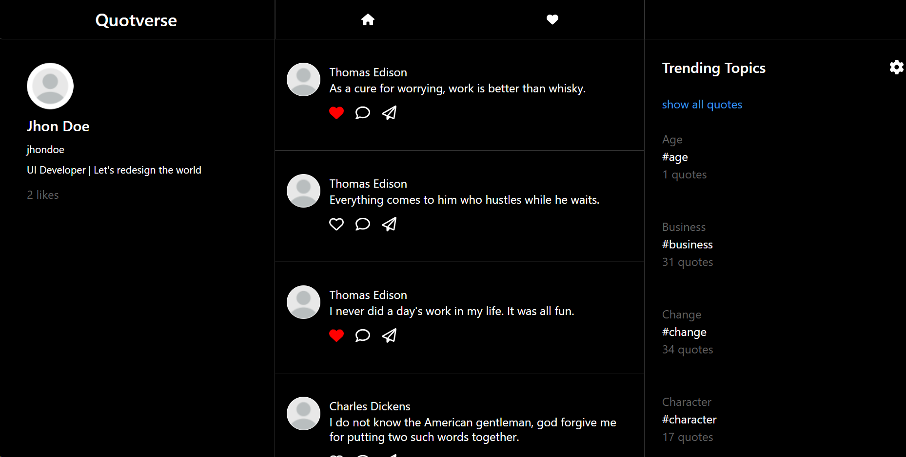

# Quotverse

The Quotverse website aims to provide users with a visually appealing platform to discover, share, and engage with famous quotes sourced from the [quotable.io](https://github.com/lukePeavey/quotable) API. The website mimics the user experience of popular social media platforms like Twitter, allowing users to interact with quotes by liking, commenting, and sharing.

## Features:

- Display a feed of quotes fetched from quotable.io using the following API endpoints:
  - Get random quotes
  - List quotes
  - Get quote by ID
- Quotes are presented in a visually appealing format resembling Twitter tweets or thread posts.
- Users can like quotes by clicking a heart icon on each post.
- Clicking on each post opens it in its own page.
- Liked quotes are stored in a separate section.
- Users can unlike a quote from both the main feed and the "Liked Quotes" section.
- Trending topic section on the right side lists a few tags provided by quotable.io.
- Clicking on these tags displays quotes related to those tags.
- Quotes can be shared across various platforms, such as Facebook, Twitter, and Instagram.
- A share icon on each post allows users to easily share their favorite quotes.
- Responsive design provides an optimal viewing experience across various devices, including desktops, tablets, and smartphones.
- For mobile devices, the left side with user information is removed, and the trending topics section is moved to a double bar icon button on the top right. Clicking on this button reveals the right side, showcasing trending topics.
- State management is implemented using Redux to efficiently handle the application's state.

## Technologies Used:
- React JS
- Redux
- Tailwind CSS
- Axios
- And much more!

